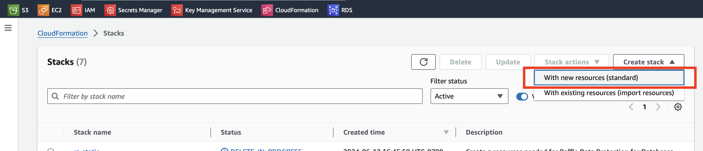
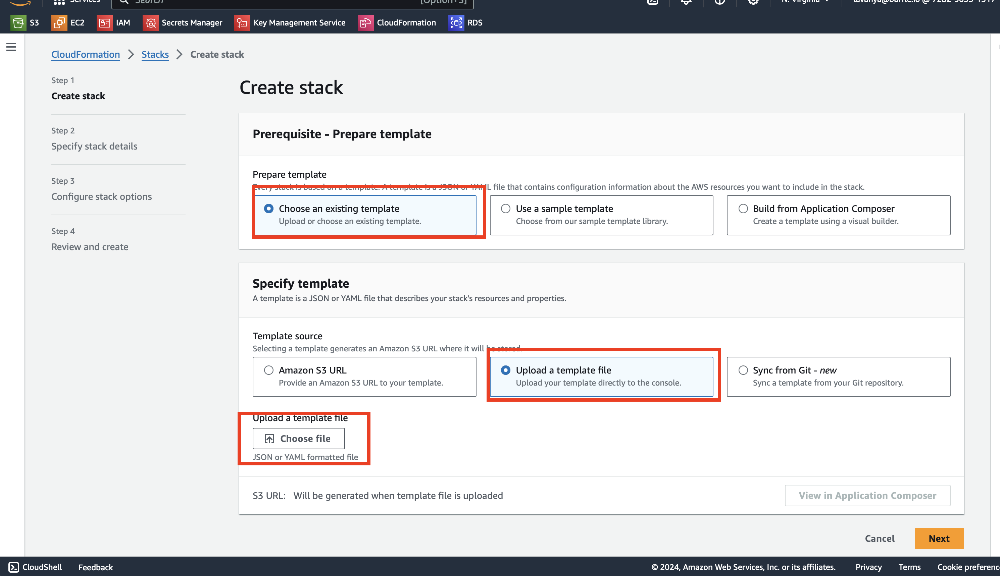
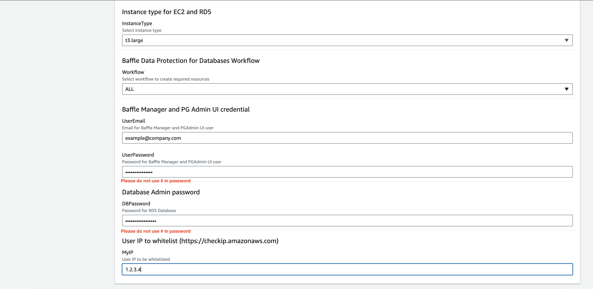

# Infrastructure Setup

In order to continue with infrastructure set up, please make sure prerequisites mentioned in previous sessions are completed or verified.

## AWS IAM Setup

Prior to creating infrastructure, an IAM group is set up with a policy that has relevant permissions for the infrastructure creation and usage.
    

1.  Download the “create_group_role_template.yaml” file from this location: [baffle-public/market-place/cloudformation-template/lower-environment/create_group_policy at master · baffle/baffle-public (github.com)](https://github.com/baffle/baffle-public/tree/master/market-place/cloudformation-template/lower-environment/create_group_policy)
    
2.  As an AWS Admin, log in to the AWS console and go to the CloudFormation service
    
3.  Click Stacks->Create Stack->With new resources(standard)

    
4.  Select Choose and existing template then Upload a template file then Choose file and navigate to the file. Select the file and click Open. Click Next

    
5.  In Stack Name, enter a name for the stack. This will also become the name of the resulting user group, with “-group” appended. ie <iam-stack-name>-group. Click Next

6.  Leave all defaults. Click Next
    
7.  Under Capabilities, check the box acknowledging that IAM resources will be created. Click Submit
    

Now we will add the user that will be creating the infrastructure to the IAM group Created in prior steps.
    

1.  As an AWS Admin, log in to the AWS console and go to the IAM service
    
2.  Go to the IAM services and click User groups. Ensure the new user group is there.
    
3.  Click Users->Create User. Enter a User Name. Check the box to provide user access to the AWS management console.
    
4.  Select the method you prefer for setting the password for console access and click Next.
    
5.  In Permissions Options, select Add user to group and then below that, check the box that corresponds to the group created above. Click Next.
    
6.  Click Create user
    
7.  Note the password or download the csv file. Click Return to users list
    

## Setup the AWS infrastructure

1.  Download the “create_baffle_workflows_template.yaml” from this location: [baffle-public/market-place/cloudformation-template/create_baffle_workflows_template.yaml at master · baffle/baffle-public (github.com)](https://github.com/baffle/baffle-public/blob/master/market-place/cloudformation-template/create_baffle_workflows_template.yaml)
    
2.  Either as an AWS admin or the user created in the “AWS IAM Setup” section above, log into the AWS console and go to the CloudFormation service.
    
3.  Click Stacks->Create Stack->With new resources(standard)

    
4.  Select Choose an existing template then Upload a template file then Choose file and navigate to the file. Select the file and click Open. Click Next

    
5.  In Stack Name, enter a name for the stack, we will refer to it as <baffle-stack-name>
    
6.  In Parameters
    

    1.  Workflow - Please select "ALL"
    
    2.  UserEmail - create a username (email suggested) for Baffle Manager and pgAdmin
    
    3.  UserPassword- create a password for Baffle Manager and pgAdmin
    
    4.  DBPassword - create a password for the RDS database that will be created. ****Please DO NOT use  "#" in the password ***.
    
    5.  MyIP - enter the IPv4 address of your location which can be found at [https://checkip.amazonaws.com](https://checkip.amazonaws.com) This is to add you to the security group so you can access the AWS infrastructure that this CF template will create.
    
    6.  Take note of all the credentials as they will be needed later. Click Next

 

 8.  Leave the defaults. Click Next
    
 9.  Under Capabilities, check the box acknowledging that IAM resources might be created (though none will be). Click Submit
    

Note! It can take up to 20 minutes for this CF template to run. This lab can’t continue until the stack status = CREATE_COMPLETE

Once the Cloudformation status shows "CREATE_COMPLETE", please note below information from Output tab and keep it handy for Labs

1. BaffleEC2SecurityGroup -  The Security Group that white list user IP
2. DMSMigrationTaskURL - The URL for DMS Migration task for easy navigation
3. BaffleManagerURL - The URL for Baffle Manager
4. PGAdminWebURL - The URL for PG Admin UI
5. StackRegion  - The region where stack is deployed
6. StartMigrationTask - The CLI command to start the migration task
7. StopMigrationTask - The CLI command to stop the migration task
