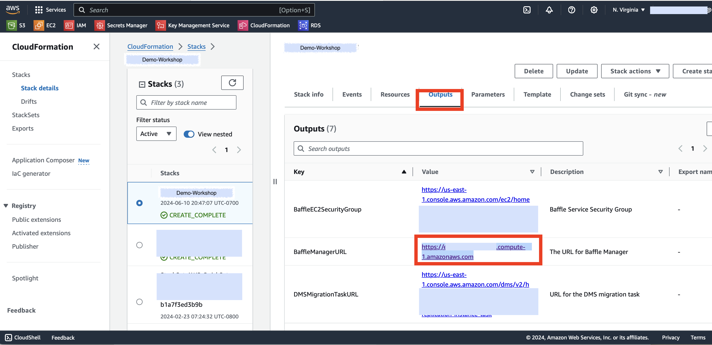
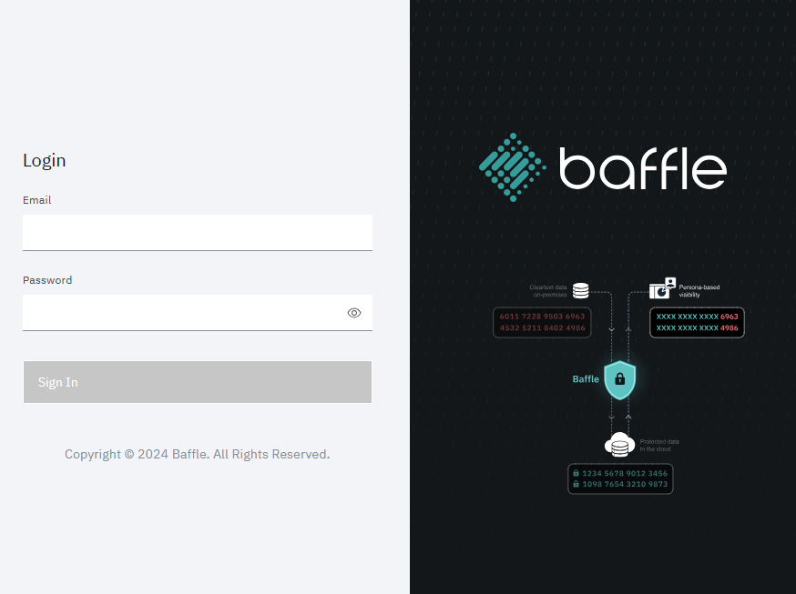
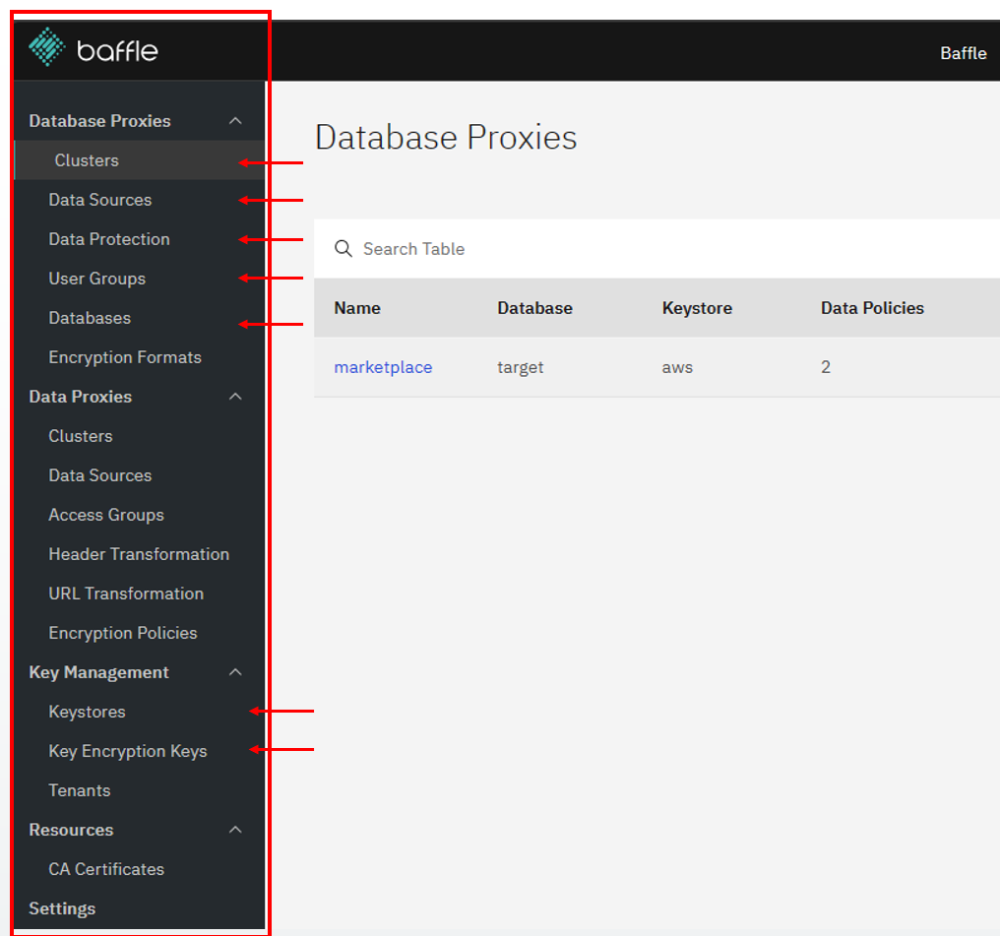

##  Verify installation 

1.  Login into the AWS Console and navigate to the CloudFormation service. Click Stacks->(baffle-stack-name) and a window slides in from the right.
    
2.  Click the Outputs tab, Find and right click the link next to the BaffleManagerURL and select “open in new tab”. A new browser tab for Baffle Manager will appear.

    
3.  In the new tab, click through the privacy warnings because a self-signed certificate was used. In production, proper certificates and trust would have to be established.
    
4.  Log in with the Baffle Manager credentials you provided in the "Getting Started" section of this lab.

      

Figure 2. Baffle Manager Login Page

Once logged in, note the left navigation pane (Figure 3). This is where all processes start. The first section is Database Proxies and is the focus of this demonstration. The next section is for managing the Data Proxy, which is a separate Baffle product. Just note that several sub-headers have the same name in both the Database Proxies and Data Proxies sections, so make sure to use the Database Proxies section.

For this demonstration, Baffle Manger has already been programmed through our API. However, we will step through the artifacts here.

Figure 3. Baffle Manager Left Navigation

Check to ensure CloudFormation created the following:

-   Key Management -> Key Encryption Keys -> alias/<stack_name>-baffle-shield-key. The KEK and related DEK are specified here.
    
-   Key Management -> Keystore -> aws-kms. This specifies AWS KMS and S3 location for storing the key encryption key (KEK) and data encryption key (DEK) respectively.
    
-   Database Proxies -> Databases -> PostgreSQL This is the target database that will contain the de-identified data
    
-   Database Proxies -> Data Protection -> ccn-fpe-cc and ssn-fpe-decimal. This is the policy for encrypting ssn and ccn using format-preserving encryption. The ccn encryption has an additional step for ensuring the ciphertext passes the Luhn check.
    
-   Database Proxies -> Data Sources-> ccn_dms_ds and ssn_dms_ds. This is the location of the social security numbers (ssn) and credit card numbers (ccn) to be protected. This includes the database, schema, table, column, and datatype.
    
-   Database Proxies -> Clusters -> proxy-_static_mask. This is where Baffle Shield is configured and programmed.

