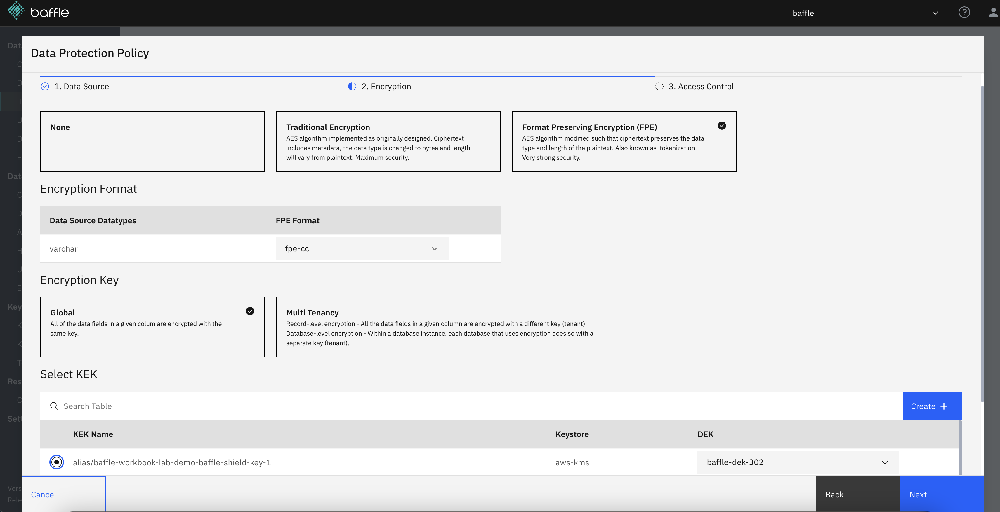

# Lab 1 - MASKING FOR DEV/TEST ENVIRONMENTS

## Enable Masking Policies (For Reference)

The CloudFormation template you used to perform setup at the beginning of 
the workshop has used Baffle Manager’s REST APIs to prepopulate your 
deployment with the data sources and masking policies needed to 
successfully complete this lab. As a reference, the instructions below 
describe how these policies can be created if you were to do so manually 
through the user interface. They walk through how to define the data 
sources in and apply masking policies on the credit card and social security 
numbers in the customers table.

In this lab, the Data sources will be defined. These are credit card numbers (CCN) and social security numbers (SSN) in a table called customers. Data Protection policies for those data sources will then be created and applied to the Baffle Shield configuration.

### **Define Data Sources**

Please navigate to Baffle Manger URL and login.
  
1.  In the left navigation pane, under Database Proxies, click Data Sources

 
2.  In the top right, click Create + to go to the Data Source Details page
    
3.  Provide a friendly name in the “Name” field. In this example, “ccn” is used.
    
4.  Under Fields select the Database Columns box
    
5.  In the Database Reference drop-down, select the name of the target database
    
6.  In the bottom right, click Next to go to the Configure Dataset page
    

7.  Across the top are four options: Direct Input, Import, Search, and Browse. The search and browse options are only available if the target database has existing data. In this example, the data has not been entered in the database yet, so these options won’t work. The Import option is for using a CSV file to bulk import database columns. We will be using the Direct Input option to manually enter the database columns that we intend to encrypt.
    
8.  In the Database Name field, enter the name of the database. In this example use “target”
    
9.  In the Schema Name field, enter the name of the database schema. In this example use “public”
    
10.  In the Object Type drop down, select Table
    
11.  In Table Name enter the table. In this example, enter customers
    
12.  In Column Name enter the column. In this example, enter “ccn”
    
13.  In Datatype enter the data type. In this example, enter “varchar(50)”
    
14.  Click the box that says Add to selected columns and note the definition of this column appears in the right pane.
    
15.  In the bottom right, click Create. You will be returned to the Data Sources list

    
16.  Repeat steps b to o exactly with two exceptions. In step c, name this data source “ssn” and in step l, name the column “ssn”
    
17.  At this point, “ccn” and “ssn” datasources should be defined

### **Define Data Protection Policy(DPP) with format preserving encryption (FPE)**

1.  In the left navigation pane, under Database Proxies, click Data Protection
    
2.  In the top right, click Create + to go to the Data Source page
    
3.  In Policy Name enter a friendly name. In this example, use “ccn-fpe-cc”
    
4.  Under Select Data source check the little box next to “ccn”
    
5.  In the bottom right, click Next to got to the encryption page

    
6.  Click the Format Preserving Encryption box
    
7.  In the FPE Format drop down, select fpe-cc. This option is specifically designed for credit card numbers. It knows to ignore dashes and spaces and the resulting ciphertext will pass the Luhn algorithm.
    
8.  Under Encryption Key click the Global box
    
9.  Under Select KEK Select the radio button next to the “???” key encryption key.
    
10.  To the right of the KEK name is a drop down to select the corresponding DEK. For this example, click “???”
    
11.  In the bottom right, click Next to go to the Access Control page

    
12.  Do not select anything on this page because access controls will be set-up later in the dynamic data masking part of this lab. Rather, in the bottom right, click Create. This data protection policy will be created.

    
13.  Repeat steps b through l exactly with the three exceptions. In step c, the Policy Name is “ssn-fpe-decimal”. In step d, under Select Data source check the little box next to “ssn”, and in step g, under FPE Format drop down, select fpe-decimal. This encrypts only numbers from the plain text and ignores dashes and spaces.
    
14.  At this point, “ccn-fpe-cc” and “ssn-fpe-decimal” data protection policies should be defined

### **Deploy  Data Protection Policies(DPP) to Shield**
1.  In the left navigation pane, under Database Proxies, click Clusters
    
2.  In the list, select the already created cluster listed as ???. This will take you to the Overview tab. Along the top of the center pane is Overview, Instances, Data Protection, and Deployments tabs.
    
3.  Click the Instances tab and check to see if an instance of “Type” = “DB_PROXY” and its status is “Running” and “Deployment Status” is “UP TO DATE”
    

4.  Click the Data Protection tab.
    
5.  In the upper right, click Deployment +
    
6.  In the Action drop down select Add Policies
    
7.  In the Add New Data Protection Policies section, check the box for the ccn-fpe-cc and ssn-fpe-decimal Policies.
    
8.  viii.In the right pane at the top, in the Deployment Name field we can enter a friendly name. For this example, enter “deploy_encryption_policies”
    
9.  Enter any description desired in the Description field.
    
10.  In the bottom right, click Create. The window will return to the Data Protection tab.
    

Click the Instances tab and check to see if an instance of “Type” = “DB_PROXY” and its status is “Running” and “Deployment Status” is “UP TO DATE”

