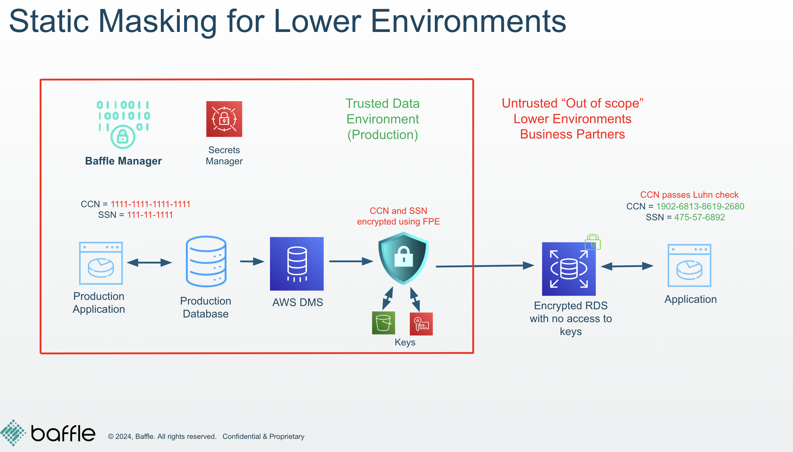

# Lab 1 - MASKING FOR DEV/TEST ENVIRONMENTS

## Scenario  
To begin the modernization process, the first step is to set up a test/development environment on AWS. This environment will allow the application team to develop and test the updated version of the application within the new cloud infrastructure. Given that it is a test/development environment, it is crucial that the database does not contain any sensitive data. To address this, Baffle’s static masking feature can be utilized to anonymize sensitive information as it is copied from the production databases to the new PostgreSQL database. This approach ensures data privacy while streamlining the workflow.

## Goals for this lab  
After completing this lab, you will have a PostgreSQL database with a  
statically masked dataset created from a cleartext dataset. You will be able  
to verify that the demo application can work directly against masked  
database and see only masked values for sensitive data fields.  

## Brief overview of Lab 1  

During this lab, you will perform the following steps to enable a continuous static  
data masking workflow to create an anonymized dataset on a test/dev database:  
- Enable masking policies  
- Trigger DMS job to perform initial masking of data  
- Verify the sample application works with masked data  
- Add new data to production database and verify that new data is  
automatically transferred and masked in test/dev database  

The setup process you initiated at the beginning of the workshop will prepopulate  
your Baffle Manager with the masking policies needed. 
