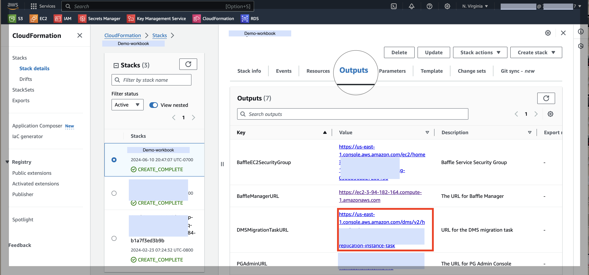
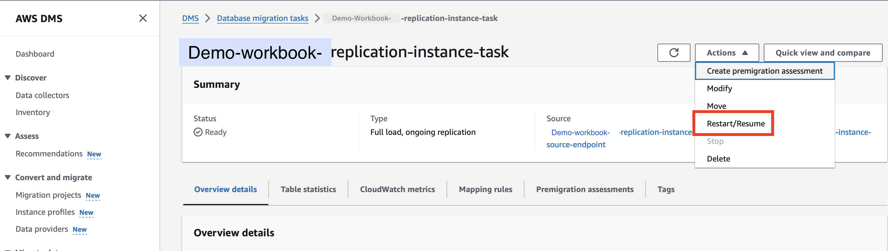

# Lab 1 - MASKING FOR DEV/TEST ENVIRONMENTS

## Trigger DMS job to perform initial masking of data

Trigger DMS to start copying any data in the production database (dms_source_db) to the lower environment database (dms_target_db) on a continual basis

   

1.  Login into the AWS Console and navigate to the CloudFormation service. Click Stacks->(baffle-stack-name) and a window slides in from the right.
    
2.  Click the Outputs tab, Find and right click the link next to the DMSMigrationTaskURL  and select “open in new tab”. A new browser tab for DMS will appear.
    
3.  In the top right of the new tab, click Actions->Restart/Resume
    

