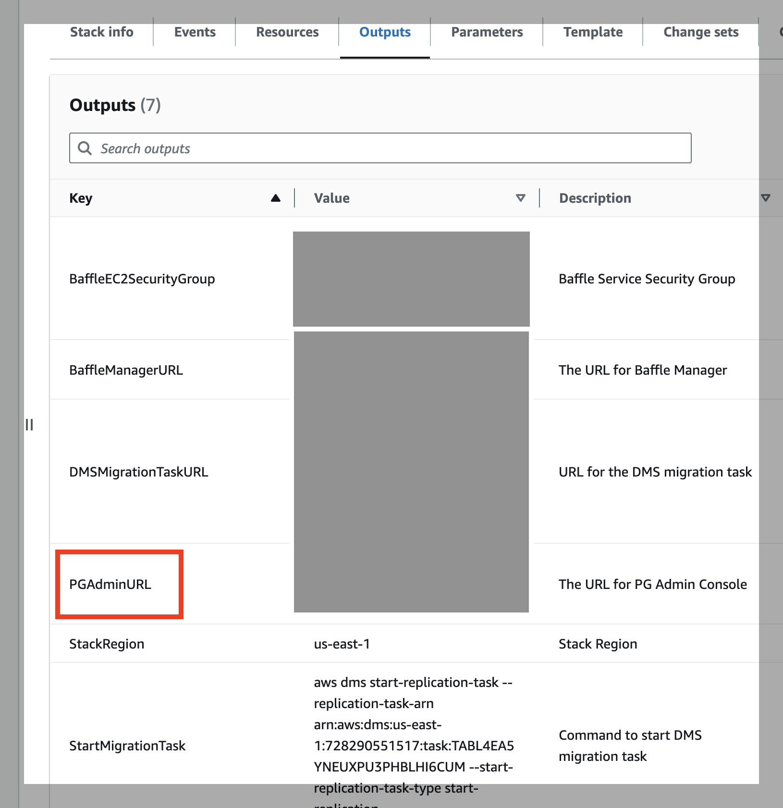
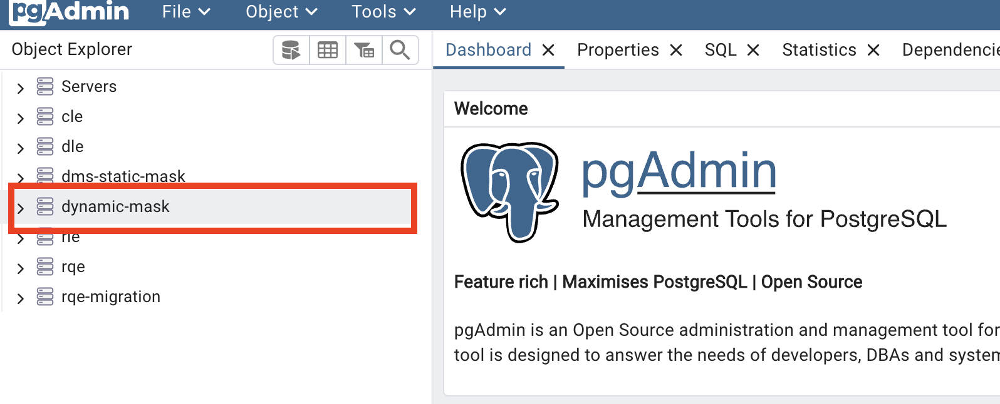

# Lab 2 - No-code Application Encryption and Dynamic Masking

Load Data into the Database
---------------------------

Using pgAdmin, you will connect to the database through Baffle Shield as the business owner, "baffle", of the data.  This will allow you to write the data into the database and have Baffle Shield encrypt the data on the way.

1.  Login into the AWS Console and navigate to CloudFormation->Stacks->(name of stack just created)->Stack Details->Outputs tab-> right on the link by the entry for PGAdminURL and select "open in new tab".  A new browser tab will appear.

   

2.  In the new tab,log into pgAdmin using the same credentials you created above (same as Baffle Manager credentials)

3.  On the left navigation pane called Object Explorer, there will be a server group "dynamic-mask". Click on the chevron by it to show the different connections.  

   

4.  Click on the chevron next to shield@baffle to connect.  Enter the RDS database password you created earlier.

5.  Under shield@baffle, click on the chevron by Databases to expand the menu below

6.  Right click dynamic_mask_db and then Query Tool. SQL queries may be done here.

7.  A table called "customers" has already been created.  Here is some highly-contrived (so it is easy to distinguish between the clear and FPE data) sample data.  Copy the data  into the "customers" table using these SQL commands:
    ```
       insert into customers (uuid, first_name, ccn, ssn, entity_id) values ('c19213ad-dff9-49a5-8ef0-fbe1964d6f66', 'Charley', '1111-1111-1111-1111', '111-11-1111', 1);
        
        insert into customers (uuid, first_name, ccn, ssn, entity_id) values ('1c598c48-2cda-4e70-99b1-a8adcc99a0a9', 'Cacilie', '2222-2222-2222-2222', '2222-22-2222', 2);
        
        insert into customers (uuid, first_name, ccn, ssn, entity_id) values ('bd58c5f8-5ca8-4a98-8a81-cf1575a7cf06', 'Jaye', '3333-3333-3333-3333', '333-33-3333', 3);
        
        insert into customers (uuid, first_name, ccn, ssn, entity_id) values ('bf9634a8-6d0b-4a4b-9658-5ca3d7a8679c', 'Katharyn', '4444-4444-4444-4444', '444-44-4444', 4);
        
        insert into customers (uuid, first_name, ccn, ssn, entity_id) values ('df59fe01-debe-4bd8-9b34-25d0469fab76', 'Val', '5555-5555-5555-5555', '555-55-5555', 5);
        
        insert into customers (uuid, first_name, ccn, ssn, entity_id) values ('7790c775-f4e1-40ca-94d9-3bc85f12ca09', 'Jefferson', '6666-6666-6666-6666', '666-66-6666', 6);
        
        insert into customers (uuid, first_name, ccn, ssn, entity_id) values ('dc23cb1a-62f1-4e2d-917f-92f24fd6578a', 'Merrielle', '7777-7777-7777-7777', '777-77-7777', 7);
        
        insert into customers (uuid, first_name, ccn, ssn, entity_id) values ('d1c12f3b-9895-478f-9f28-6773415e3373', 'Gilberte', '8888-8888-8888-8888', '888-88-8888', 8);
    

   Click the "play" button to run the query.

8.  Verify the data is in the table with this command
    ```
      select * from customers;
   Highlight that command and click the "play" button to run the query.

See the data in the data output pane below. The ccn and ssn digits are all the same number.

