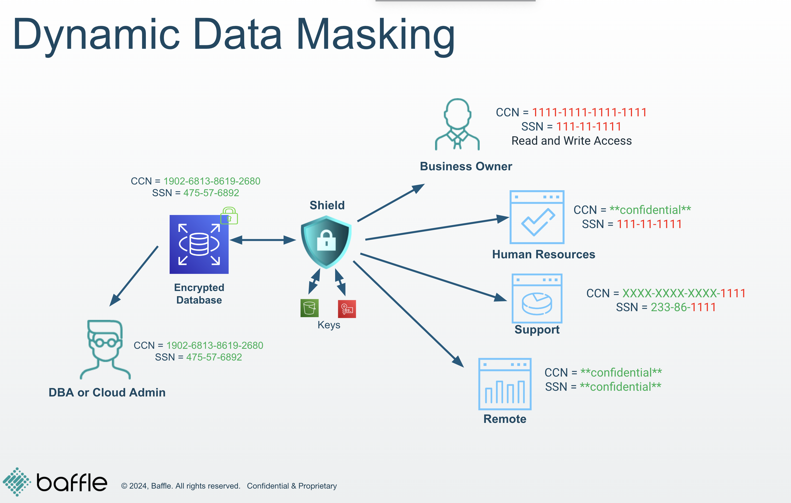

# Lab 2 - No-code Application Encryption and Dynamic Masking <!-- MODIFY THIS HEADING -->

## Scenario  
The AppDev team is making good progress and is ready to stage a  
modernized version of the application in AWS. While you’ve been able to use  
static masking in the test/dev environments to anonymize regulated data,  
you realized the applications need to run SQL operations against real data  
values to work properly. InfoSec flags the weakened security posture as a  
blocking issue.  
In the on-prem Oracle DB, you’ve previously relied on database security  
features like Transparent Data Encryption (TDE) and Database vault to  
provide the encryption and privileged user access control capabilities needed  
to comply with compliance requirements like PCI DSS, but PostgreSQL does  
not include these features natively. Fortunately, you realize that you can use  
Baffle’s Real Queryable Encryption to meet these compliance requirements.  

## Goals for this lab  
After completing this lab, you will have a PostgreSQL database with sensitive  
data columns encrypted using Baffle’s RQE. The production application will  
be able to use the DB as before. But, when DBAs attempt to connect to the  
database, either directly or through Baffle Shield, they will only see  
encrypted or masked values for the sensitive data columns.  
This demonstrates Baffle’s application encryption and privileged user access  
control capabilities not available in other databases.

## Brief overview of Lab 2.  

During this lab, you will perform the following steps to enable encryption and  
dynamic masking on a production dataset:  
- Enable data protection policies (encryption and dynamic masking)  
- Verify the data protection policies in use  
- Encrypt application data  
- Verify the sample application works as before  
- Verify DBA does not have access to sensitive data value  

