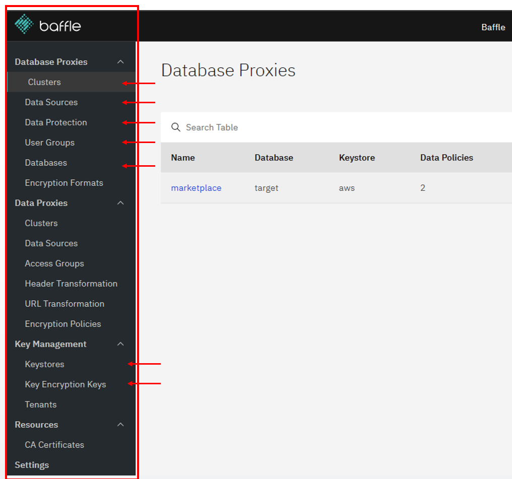

# Lab 2 - No-code Application Encryption and Dynamic Masking

## Verify Dynamic Masking Installation

Navigate to Baffle Manger URL

Check if below components, RBAC and Encryption policies are setup:
-   Key Management -> Keystore -> aws-kms. This specifies AWS KMS and S3 location for storing the key encryption key (KEK) and data encryption key (DEK) respectively.

-   Key Management -> Key Encryption Keys -> alias/<stack_name>-baffle-shield-key. The KEK and related DEK are specified here.

-   Database Proxies -> Clusters -> db-proxy-postgres. This is where Baffle Shield is configured and programmed.
    
-   Database Proxies -> Databases -> PostgreSQL This is the database that will contain the de-identified data (sales_dev database, public schema, customers table, and ssn column)
    
-   Database Proxies -> Data Sources-> customer-ssn. This is the location of the social security numbers (ssn) and credit card numbers (ccn)to be protected. This includes the database, schema, table, column, and datatype.
    
-   Database Proxies -> Data Protection -> ssn-fpe-policy. This is the policy for encrypting ssn using format-preserving encryption.

-   Database Proxies -> User Groups. Users are assigned to groups here and then groups will be assigned access in the Data Protection.
    

Figure 3. Baffle Manager Left Navigation

