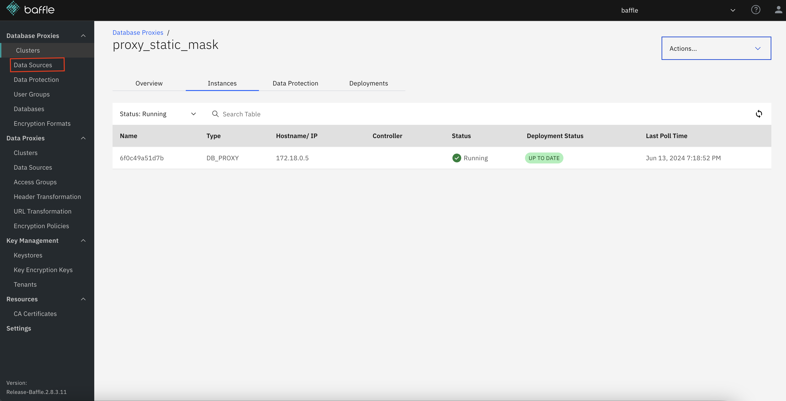

# Lab 2 - No-code Application Encryption and Dynamic Masking

## Setup Rules and Policies (For Reference)

**NOTE**: As with the previous lab, the CloudFormation template you used to perform 
setup at the beginning of the workshop has used Baffle Manager’s REST APIs 
to prepopulate your deployment with the RBAC rules and encryption and 
dynamic masking policies needed to successfully complete this lab, so you 
need not take any actions to set up the RBAC rules. Nonetheless, the 
instructions provided below are provided as a reference and describe how 
rules policies can be created if you were to do so manually through the user 
interface. They walkthrough how to provision users and map them to 

This lab will provision some database users (harry, sally, ron) and respective grants along with the infrastructure. The Baffle policies have already been created by CloudFormation, so this section may be skipped for this lab.  However, the process for creating them is outlined here for learning and/or future reference. 

| DB users | Provisioned/LAB | 
|--|--|--|
| harry | Provisioned |
| sally | Provisioned | 
| ron |Provisioned |

**Set up users in Database**

1.  Login into the AWS Console and navigate to the CloudFormation service. Click Stacks->(baffle-stack-name) and a window slides in from the right.
    
2.  Click the Outputs tab, Find and right click the link next to the PGAdminURL and select open in new tab. A new browser tab for pgAdmin will appear.
    
3.  In the new tab, log into pgAdmin using the credentials you created (same as Baffle Manager credentials). The pgAdmin dashboard should appear.
    
4.  On the left navigation pane called Object Explorer, will be a database server called “dynamic-mask”, click on the chevron by it to show the different connections.

5. Click the chevron next to direct@baffle and a window will pop-up. Enter the RDS database password you created earlier and click OK.
    
6.  Click the chevron next to Databases. Right click dynamic-mask and then Query Tool. A new SQL command window will open on the right.

7.  Create these three users with these SQL commands:

		
		create user harry password 'harry';

		create user sally password 'sally';

		create user ron with password 'ron';
	
8.  Grant those users access to the table “customers” using these SQL commands:

  
	
			grant usage on schema public to harry;

			grant select on table customers to harry;

			grant usage on schema public to sally;

			grant select on table customers to sally;

			grant usage on schema public to ron;

			grant select on table customers to ron;	
    
**Setup Baffle RBAC**

Please navigate to Baffle Manger URL and login.

1.  In the left navigation pane, under Database Proxies, click Data Sources

2.  In the left navigation pane, under Database Proxies, click **User Groups**
3.  In the top right, click **Create +**. A panel will slide in from the right.
5.  In _User Group Name_, enter “human_resources”
6.  In _Users_, type in “harry”
7.  In the bottom right, click **Create**. The User Groups list page will appear.
8.  In the top right, click **Create +**. A panel will slide in from the right.
9.  In _User Group Name_, enter “support”
10.  In _Users_, type in “sally”
11.  In the bottom right, click **Create**. The User Groups list page will appear.
12.  In the top right, click **Create +**. A panel will slide in from the right.
13.  In _User Group Name_, enter “remote”
14.  In _Users_, type in “ron”
15.  In the bottom right, click **Create**. The User Groups list page will appear with all three groups listed:

## Setup Baffle RBAC rules with Dynamic Masking Policies

**Define data sources.**

1. In the left navigation pane, under Database Proxies, click Data Sources
2. In the top right, click Create + to go to the Data Source Details page
3. Provide a friendly name in the “Name” field.  In this example, enter “ccn”
4. Under Fields select the Database Columns box
5. In the Database Reference drop-down, select the name of the target database
6. In the bottom right, click Next to go to the Configure Dataset page
7. Across the top are four options: Direct Input, Import, Search, and Browse.  The search and browse options are only available if the target database has existing data.  In this example, the data has not been entered in the database yet, so these options won’t work.  The Import option is for using a CSV file to bulk import database columns.  We will be using the Direct Input option to manually enter the database columns that we intend to encrypt.
8. In the Database Name field, enter the name of the database.  In this example use “target”
9. In the Schema Name field, enter the name of the database schema.  In this example use “public”
10. In the Object Type drop down, select Table
11. In Table Name enter the table. In this example, enter customers
12. In Column Name enter the column. In this example, enter “ccn”
13. In Datatype enter the data type.  In this example, enter “varchar(50)”
14. Click the box that says Add to selected columns and note the definition of this column appears in the right pane.
15. In the bottom right, click Create. You will be returned to the Data Sources list
16. Repeat these steps with two exceptions name this data source “ssn”, name the column “ssn”
17. At this point, “ccn” and “ssn” datasources should be defined:

**Define Data Protection Policy implementing format preserving encryption (FPE)**
1.  In the left navigation pane, under Database Proxies, click **Data Protection**
2.  In the top right, click **Create +** to go to the Data Source page
3.  In _Policy Name_ enter a friendly name.  In this example, use “ccn-fpe-cc”
4.  Under _Select Data source_ check the little box next to “ccn”
5.  In the bottom right, click **Next** to got to the encryption page
6.  Click the **Format Preserving Encryption** box
7.  In the _FPE Format_ drop down, select **fpe-cc**. This option is specifically designed for credit card numbers.  It knows to ignore dashes and spaces and the resulting ciphertext will pass the Luhn algorithm.
8.  Under _Encryption Key_ click the **Global** box
9.  Under _Select KEK_ Select the radio button next to the “alias/<cloudfoamtion stack name>-baffle-shield-key-1” key encryption key.
10.  To the right of the KEK name is a drop down to select the corresponding DEK.  For this example, click “baffle-dek-641”
11.  In the bottom right, click **Next** to go to the Access Control page
12.  Do not select anything on this page because access controls will be set-up later in the dynamic data masking part of this lab. Rather, in the bottom right, click **Create.** This data protection policy will be created.
13.  Repeat these steps with the three exceptions  the _Policy Name_ is “ssn-fpe-decimal”, under _Select Data source_ check the little box next to “ssn”, under _FPE Format_ drop down, select **fpe-decimal**. This encrypts only numbers from the plain text and ignores dashes and spaces.
14.  At this point, “ccn-fpe-cc” and “ssn-fpe-decimal” data protection policies should be defined:

**Deploy the Data Protection Policies to Shield**

1.  In the left navigation pane, under Database Proxies, click **Clusters**
2.  In the list, select the already created cluster listed as **proxy_dynamic_mask**. This will take you to the Overview tab. Along the top of the center pane is Overview, Instances, Data Protection, and Deployments tabs.
3.  Click the **Instances** tab and check to see if an instance of “Type” = “DB_PROXY” and its status is “Running” and “Deployment Status” is “UP TO DATE”

Figure 6. Baffle Shield is Connected

1.  Click the **Data Protection** tab.
2.  In the upper right, click **Deployment +**
3.  In the _Action_ drop down select **Add Policies**
4.  In the _Add New Data Protection Policies section_, check the box for the **ccn-fpe-cc** and **ssn-fpe-decimal** Policies.
5.  viii.In the right pane at the top, in the _Deployment Name_ field we can enter a friendly name.  For this example, enter “deploy_encryption_policies”
6.  Enter any description desired in the _Description_ field.
7.  In the bottom right, click **Create.** The window will return to the Data Protection tab.
8.  Click the **Instances** tab and check to see if an instance of “Type” = “DB_PROXY” and its status is “Running” and “Deployment Status” is “UP TO DATE”

