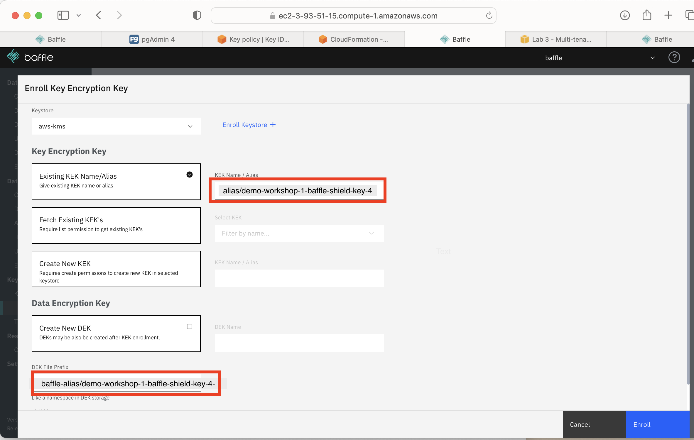
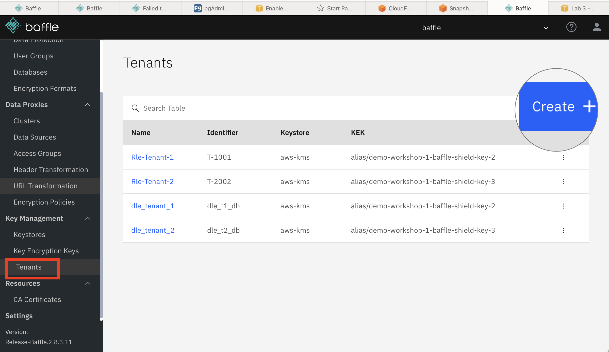
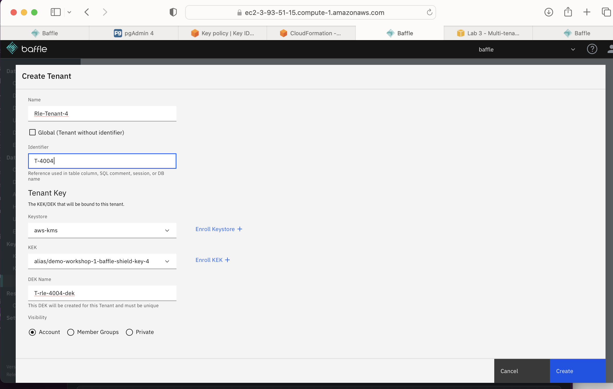
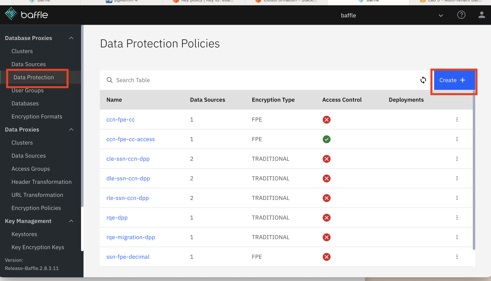
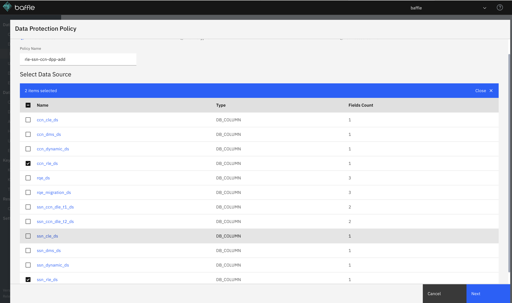

##  Enroll new tenants and assign keys (For Reference)

**NOTE**: As with the previous lab(s), the CloudFormation template you used to perform
setup at the beginning of the workshop has used Baffle Manager’s REST APIs
to prepopulate your deployment with the Tenant creation and row level encryption
policies needed to successfully complete this lab, so you
need not take any actions to set up the Tenants or RLE policies. Nonetheless, the
instructions provided below are provided as a reference and describe how
rules policies can be created if you were to do so manually through the user
interface. They walkthrough how to provision new tenants and assign keys along with setting up encryption policies.

In this lab the below Tenants and Keys are prebuilt and provisioned with cloudformation scripts for demonstration purposes.  Two set of extra Keys are to be associated with new Tenants. 
|Tenant ID| Identifier| key |
|--|--|--|
| Rle-Tenant-1 | T-1001 | alias/<cloudformation stack name>-baffle-shield-key-2|
|Rle-Tenant-2|T-2002 | alias/<cloudformation stack name>-baffle-shield-key-3 |
| | | alias/<cloudformation stack name>-baffle-shield-key-4|
| | | alias/<cloudformation stack name>-baffle-shield-key-5|

The following steps will outline how new tenants can be enrolled and how to assign keys to new tenants if you wish to create a new tenant and test it out after going through the lab.  In this lab environment we do provide two extra Keys(KEK) to use for testing but we do not provide facility to generate new Keys(KEK).

Navigate to  Baffle Manager URL  and login.

To add the key encryption key:

1. In the left navigation pane, click Key Encryption Keys
2. In the upper right click Enroll +
3. In the Keystore field, enter aws-kms
4. Click the Existing KEK Name/Alias box, then enter in the field next to it: alias/<baffle-stack-name>-baffle-shield-key-4, where baffle-stack-name is the name you gave the cloud formation template.   To be sure, you can check the Outputs tab of the AWS Cloud  Formation template.
5. DEK File Prefix: aws-test-rle
6. Click Enroll

To Add a new Tenant:

1.  In the left navigation pane, click **Tenants**
2.  In the upper right click **Create +**

3.  In the _Name_ field, enter  Rle-Tenant-4
4.  In the _Identifier_ field enter T-4004
5.  In the _Keystore_ drop-down, select aws-kms
6.  In the KEK dropdown, select alias/<baffle-stack-name>-baffle-shield-key-4
7.  In the _DEK Name_ field enter T-rle-4004-dek

Create a new policy that includes the new tenant:

1.  In the left navigation pane, under Database Proxies, click **Data Protection**
2.  In the upper right click **Create +**

3.  In _Policy Name_ enter rle-ssn-ccn-dpp-add
4.  Under Data Source, click the boxes for both ccn_rle-ds and ssn_rle_ds

5.  Click **Next**
6.  Click the **Traditional Encryption** box
7.  Click the **AES Deterministic** box
8.  Click the **Multi Tenancy** box
9.  In the _Tenant Determination_ drop-down, select TENANT_COLUMNS
10.  Click all the boxes for Rle-Tenant-1, Rle-Tenant-2, and Rle-Tenant-4
11.  Under _Tenant Columns_, in the drop-down, select **entity_id**
12.  Click **Next**

13.  DO NOT click the Enable Data Access Control box.  If you do, click it again to uncheck it.
14.  In the lower right, click **Create**
15.  In the resulting list, rle-ssn-ccn-dpp-add is added.

**Add the new policy with the new tenant**

1. In the left navigation pane, under Database Proxies, click Clusters
2. Click on proxy_rle
3. Along the top are tabs.  Click on Data Protection
4. In the top right, click on Deployment +
5. Under the _Action_ drop-down, select **Add Policies**
7. In the _Deployment Name_ field, enter policy-add-tenant-4
8.  _Description_ field is optional
9.  In the bottom right, click **Create.**

