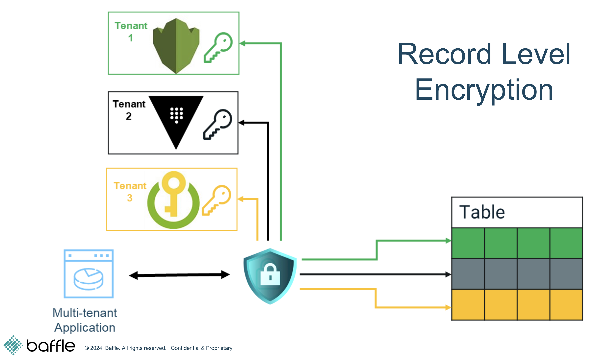

## Scenario  
You receive an urgent request from the Institutional Clients department that  
a very important European client has requested assurances that their data is  
securely isolated from all other clients and that they have the option to  
remove their data from your systems at any time. While it’s possible to set  
up an entirely parallel application and database infrastructure for this client,  
it’s a costly and unscalable solution given that you foresee other large clients  
making the same request. Instead, you decide to address this requirement  
by using Baffle’s multi-tenant encryption capabilities to give the client  
cryptographically enforced isolation of their own data. compliance  
requirements.  

## Goals for this lab  
After completing this lab, you will have at least one tenant created with its  
encrypted using the tenant key. You will be able to validate that all data is  
visible in the demo application when keys are available. You will also be able  
to show that disabling access to the tenant key will make all data for that  
tenant inaccessible while data for other tenants are unaffected. Lastly, you  
will be able to validate that database administrators have no access to any  
sensitive data.  

## Brief overview of lab 3.

During this lab, you will perform the following steps to enable multi-tenant isolation  
in a PostgreSQL database:  
- Verify installation  
- Enroll new tenants and assign keys  
- Encrypt tenant data with tenant keys and verify tenant access

