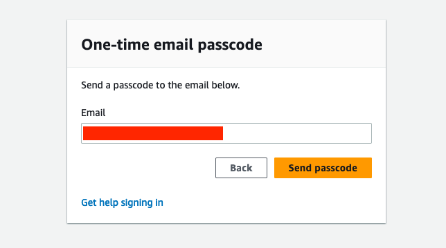

# At an AWS Workshop Event (Preferred)

-for-the-workshop)

## Using provisioned AWS accounts (via Workshop Studio) for the workshop

Your workshop facilitator will provide a URL to join the event and optionally an access code, if it's not part of the provided URL. The URL/access code grants you permission to use a dedicated AWS account for the purposes of this workshop.

Use the provided URL or go to  [https://catalog.us-east-1.prod.workshops.aws/join](https://catalog.us-east-1.prod.workshops.aws/join)

To login, choose the  **Email One-time Password (OTP)**  option and enter your email address.  _Please use your business email address._

You will receive a 6-digit one-time password in your email. Enter that into the next dialog.

After signing in, if prompted, enter the  **Event access code**  provided and select  **Next**.  

Next, Review the "Terms and Conditions" and select the checkmark to accept. Then click  **Join event**.  

